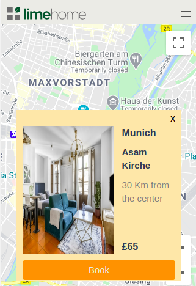
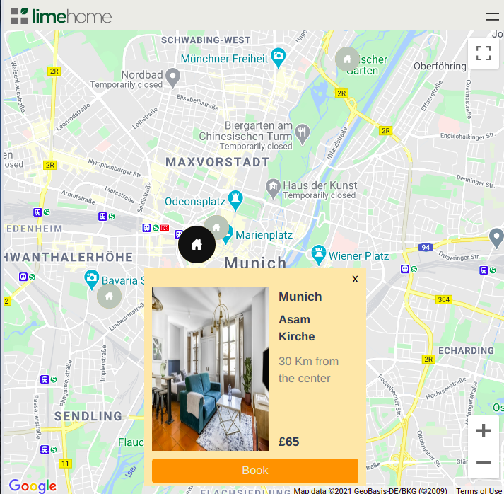
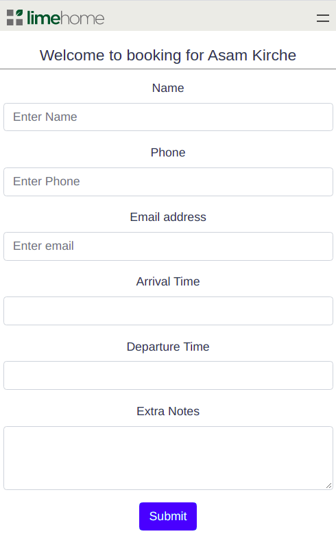

# Lime Home Booking Through Google Maps

Purpose of this application is to allow the user to select
any desired hotel rooms from the google maps and also
be able to book it.

This application consists of two parts API and UI.

## API
Api is made of Django and Django Rest FrameWork. Currently it is exposed
through open end points to create and view hotel bookings.

### Dependencies
- Python 3+ (ideally 3.5)
- Pip

### Instruction to Setup
- CD into Api
- if pip3 is not installed use this command `sudo apt-get install python3-pip`
- Create virtual environment by using python 3 with command `virtualenv -p python3 venv`
- Activate newly created virtual environment with command `source venv/bin/activate`
- At the root do `pip install -r requirements.txt`
- `python manage.py makemigrations`
- `python manage.py migrate`
- if needed create superuser `python manage.py createsuperuser`
- And run server `python manage.py runserver 8084`
- For now this URL `http://127.0.0.1:8084/` is hardcoded on the Vue client

### Instruction to Run Unit tests
- Unit tests are written to test get and post end points
- To run tests `python manage.py test service/tests/`
- All tests should run successfully

## UI-APP
UI-APP is made by Vue(version 3) and Google maps api and it is also responsive for mobile views. Purpose is to select hotel easily
through map and create booking in a form. In the backend it will communicate to
Rest API

### Dependencies
- NodeJS 8+ and npm

### Instruction to Setup
- CD into Client/ui-app
- Do `npm install`
- Do `npm run serve`
- Add Google Maps Javascript API key in `utils/gmaps.js` file
- Make sure rest api is running already at `<locahost:port>/api/` or some other host
- And Update the api url in Booking.vue

Following are the screen shots for mobile, tab views and booking form

